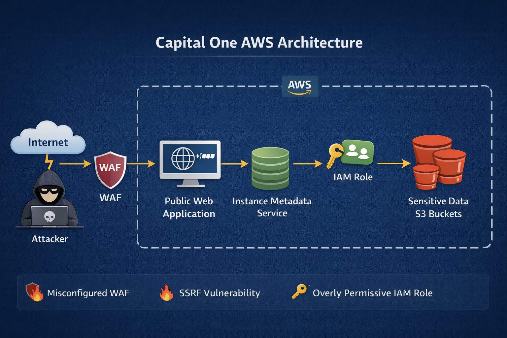
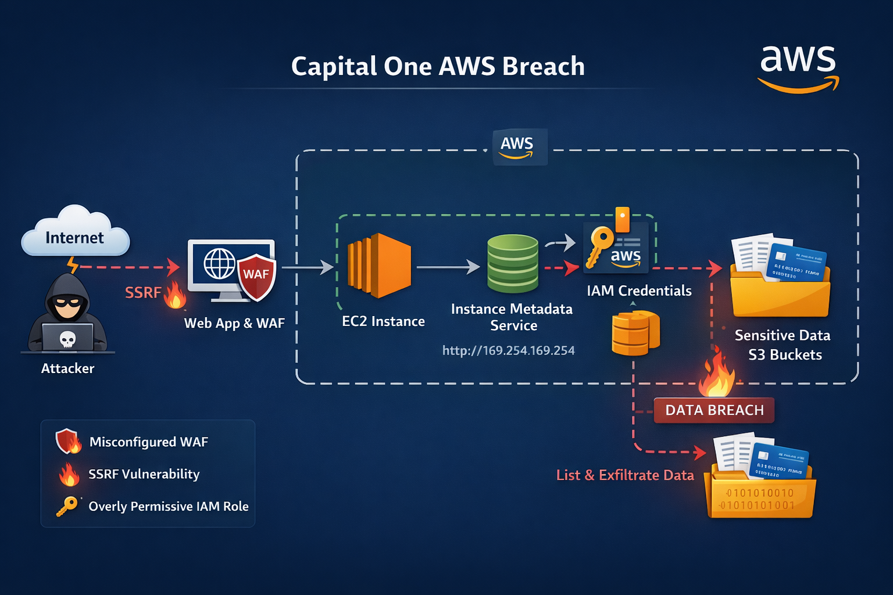
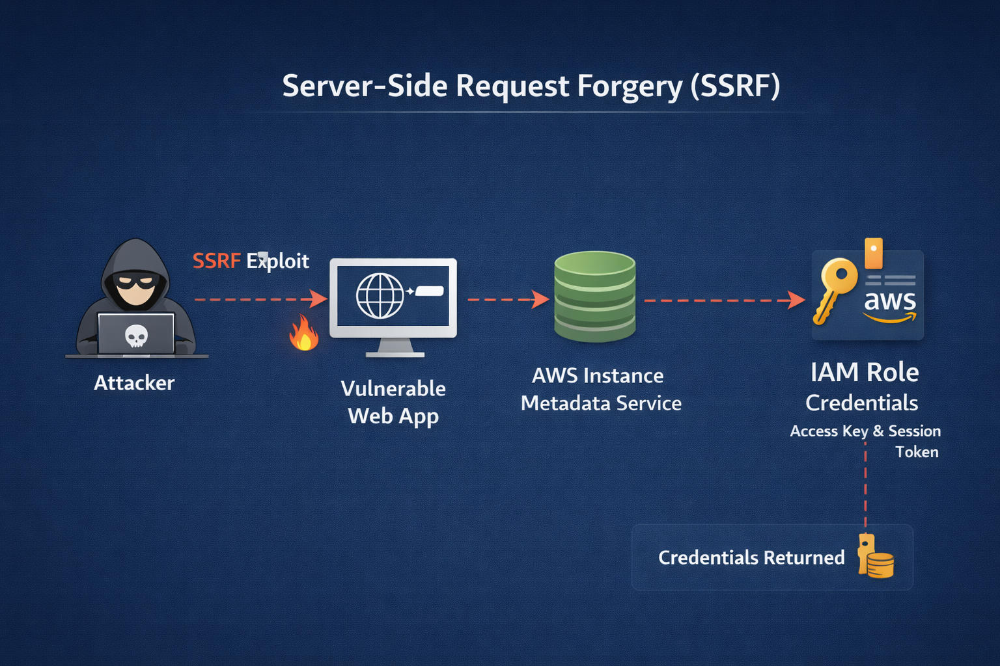

# Capital One AWS Breach (2019)
## Cloud Security Case Study

---

## Executive Summary

In 2019, Capital One experienced one of the largest cloud-based data breaches in history, affecting over **100 million individuals** in the United States and Canada. The attacker exploited a **misconfigured AWS environment** and leveraged a **Server-Side Request Forgery (SSRF)** vulnerability to access **IAM role credentials** from the AWS Instance Metadata Service. These credentials were then used to enumerate and access **Amazon S3 buckets** containing sensitive customer data.

This breach demonstrated several critical cloud security risks:

- Misconfigured cloud infrastructure  
- Overly permissive IAM roles  
- Identity-based attacks  
- Insufficient monitoring and detection  
- Cloud data exfiltration risks  

---

## AWS Architecture Overview

The Capital One environment consisted of a public-facing web application hosted in AWS behind a **Web Application Firewall (WAF)**. The application ran on an EC2 instance that had an IAM role attached.



---

## Attack Chain Overview

The attacker followed a multi-stage attack chain:

1. Reconnaissance  
2. SSRF Exploitation  
3. Metadata Service Access  
4. IAM Credential Theft  
5. AWS Resource Enumeration  
6. Data Exfiltration  



---

## Phase 1 — Reconnaissance

The attacker began by performing reconnaissance on Capital One’s infrastructure:

- Scanning endpoints  
- Testing HTTP requests  
- Identifying cloud infrastructure  

---

## Phase 2 — SSRF Exploitation

The attacker exploited a **Server-Side Request Forgery (SSRF)** vulnerability.

SSRF allows attackers to:

- Force a server to make HTTP requests  
- Access internal services  
- Bypass network controls  

```
http://169.254.169.254/latest/meta-data/
```



---

## Phase 3 — Metadata Service Exploitation

The attacker accessed:

```
http://169.254.169.254/latest/meta-data/iam/security-credentials/
```

This returned:

- Access Key  
- Secret Access Key  
- Session Token  

---

## Root Cause — Misconfigured IAM Role

The IAM role attached to the EC2 instance had excessive permissions:

- Listing S3 buckets  
- Reading S3 objects  
- Enumerating AWS resources  

---

## Phase 4 — Credential Abuse

Using stolen credentials, the attacker accessed AWS APIs:

- List S3 buckets  
- Identify sensitive data  
- Download files  

---

## Phase 5 — Data Discovery

The attacker discovered:

- Customer application data  
- Financial records  
- Credit score data  
- Personal identifiable information (PII)  

---

## Phase 6 — Data Exfiltration

The attacker downloaded data affecting:

- 100 million U.S. customers  
- 6 million Canadian customers  

---

## Why the Attack Was Successful

- SSRF vulnerability  
- Metadata service exposure  
- Overly permissive IAM role  
- Insufficient monitoring  

---

## MITRE ATT&CK Mapping

| Phase | Technique |
|------|-----------|
| Initial Access | SSRF |
| Credential Access | Metadata Service |
| Privilege Escalation | IAM Role Abuse |
| Discovery | S3 Enumeration |
| Collection | Data Retrieval |
| Exfiltration | Cloud Storage |

---

## Security Lessons Learned

### Least Privilege IAM

IAM roles should only include necessary permissions.

### Protect Metadata Service

Use **Instance Metadata Service v2 (IMDSv2)**

### Monitoring and Detection

- CloudTrail  
- GuardDuty  
- IAM monitoring  

---

## Conclusion

The Capital One breach demonstrates how **cloud misconfiguration** and **excessive permissions** can lead to large-scale data exposure.

---

## Works Cited

Capital One
https://www.capitalone.com/digital/facts2019/

ACM
https://dl.acm.org/doi/full/10.1145/3546068

Huntress
https://www.huntress.com/threat-library/data-breach/capital-one-data-breach